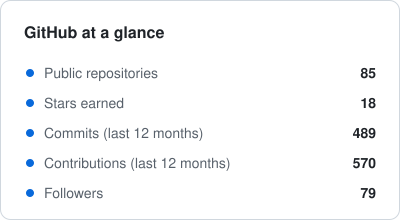
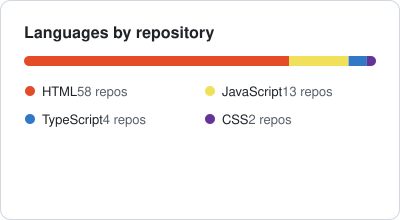
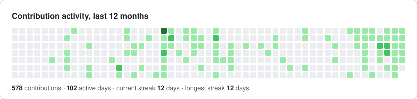

<h1 align="center">Satyaki Das</h1>

  <b>Product engineer · Data analyst · Educator</b> 
  I build education and career products, and teach the data skills behind them.

  
  
  
  

---

### About

- **Founder of [XShare](https://play.google.com/store/apps/details?id=com.xshare.learnshare)**, a career app for students and freshers: jobs, internships and scholarships in one feed, plus round-wise interview questions and a resume builder. Launched May 2026, **500+ downloads, rated 5.0 from 24 reviews**.
- **4 years as a Java full-stack developer at TCS** (2021–2025) across TCS iON Digital Campus, iON Gamelab and TCS BaNCS.

### Experience

| Role | Where | When |
|---|---|---|
| Founder & product architect | XShare | 2026 – present |
| Java Full Stack Developer: SAML 2.0 SSO (IdP/SP) for AXA Mexico | TCS BaNCS | 2025 |
| Java Full Stack Developer: browser-based learning platform | TCS iON Gamelab | 2023 – 2025 |
| Java Full Stack Developer: led the complete Arabization of the product | TCS iON Digital Campus | 2021 – 2023 |
| Co-founder & growth lead: 150K+ visitors, 25K+ community | Codewindow | 2020 – 2022 |

### Featured work

| Project | What it is |
|---|---|
| [**PostgreSQL from Zero**](https://github.com/edusatyaki/PostgreSQL-From-Zero) | A digital book that teaches SQL from scratch. Every query runs on real PostgreSQL 18. |
| [**PG Master**](https://github.com/edusatyaki/PGMaster) | Single-page reference to 459 PostgreSQL functions, each with real executed output. |
| [**SQL Roadmap**](https://github.com/edusatyaki/SQLRoadmap) | 379 LeetCode and HackerRank problems in 14 chapters, with per-student progress tracking. |
| [**Virtual Office**](https://github.com/edusatyaki/VirtualOffice) | A simulated product company where every employee is an AI agent that plans, builds and ships. |
| [**NumPyMaster**](https://github.com/edusatyaki/NumPyMaster) | 50 gamified NumPy tasks running Python in the browser via Pyodide, no backend. |
| [**System Design Hub**](https://github.com/edusatyaki/SystemDesignPro) | Interactive reference to 50 system design case studies. |
| [**Transaction Café**](https://github.com/edusatyaki/Transaction-Control) | 12 runnable PostgreSQL demos on ACID and isolation levels, with a presenter deck. |
| [**Competition Ladder**](https://github.com/edusatyaki/Competition-Ladder) | A year-wise map of 31 contests, hackathons and open-source programs for CS undergraduates. |

### Tech stack

**Data:** 
        

**Databases:** 
    

**Engineering:** 
        

**Tools:** 
     

### GitHub stats

  <picture>
    <source media="(prefers-color-scheme: dark)" srcset="assets/overview-dark.svg"/>
    
  </picture>
  <picture>
    <source media="(prefers-color-scheme: dark)" srcset="assets/languages-dark.svg"/>
    
  </picture>

  <picture>
    <source media="(prefers-color-scheme: dark)" srcset="assets/activity-dark.svg"/>
    
  </picture>

These cards are rebuilt every day by a GitHub Action from the GitHub API.

### Achievements

<table>
  <tr>
    <td width="50%" valign="top"><b>TCS CodeVita 2020: world rank 848</b> One of the world's largest coding contests, run by TCS.</td>
    <td width="50%" valign="top"><b>GATE 2021 qualified</b> Computer Science &amp; Engineering, one of India's toughest national exams.</td>
  </tr>
  <tr>
    <td width="50%" valign="top"><b>Google Code Jam, 2020 and 2021</b> Cleared the qualification round and competed in Round 1 both years.</td>
    <td width="50%" valign="top"><b>Google Hash Code 2021</b> Global rank 4,869 in Google's team programming competition.</td>
  </tr>
  <tr>
    <td width="50%" valign="top"><b>Infosys HackWithInfy: qualified</b> Cleared Infosys' national coding championship, which led to an Infosys offer.</td>
    <td width="50%" valign="top"><b>TechGig Code Gladiators 2021</b> Semi-finalist in the individual track of India's largest coding contest.</td>
  </tr>
  <tr>
    <td width="50%" valign="top"><b>Ranked 3rd in MCA and BCA</b> MCA (9.49) and BCA (9.11) at Techno Main Salt Lake.</td>
    <td width="50%" valign="top"><b>2,500+ students guided</b> Mentored college students for placements and career readiness.</td>
  </tr>
  <tr>
    <td width="50%" valign="top"><b>TCS Gems: Fresco Play Miles Award</b> November 2021, for sustained completion of internal learning courses.</td>
    <td width="50%" valign="top"><b>TCS Gems: Continuous Feedback Star</b> December 2022, recognised as a role model for continuous feedback.</td>
  </tr>
  <tr>
    <td width="50%" valign="top"><b>Certified: Microsoft and IIT Kharagpur</b> HTML5 Application Development (Microsoft Associate, 2018) and DBMS from IIT Kharagpur.</td>
    <td width="50%" valign="top"><b>AWS Academy Educator</b> Accredited to teach the AWS Academy curriculum.</td>
  </tr>
</table>

### Education

| Degree | Institution | Result |
|---|---|---|
| M.Tech, Computer Technology | Jadavpur University, 2021–2024 | 7.43 CGPA |
| MCA | Techno Main Salt Lake (MAKAUT), 2018–2021 | 9.49 DGPA · ranked 3rd |
| BCA | Techno Main Salt Lake (MAKAUT), 2015–2018 | 9.11 DGPA · ranked 3rd |

<b>M.Tech research: multimodal life-logging with NLP</b>

 

An automated pipeline that captures video, audio, speech, fitness, activity and weather data and turns it into structured, searchable life-logs and reports. It uses MediaPipe and TensorFlow Lite for vision, speech-to-text, and a BERT-based classifier, with its own ingestion, processing, storage and reporting stages.

